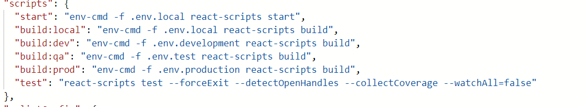
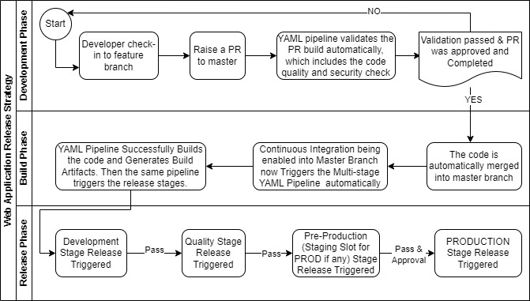
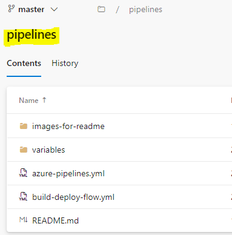
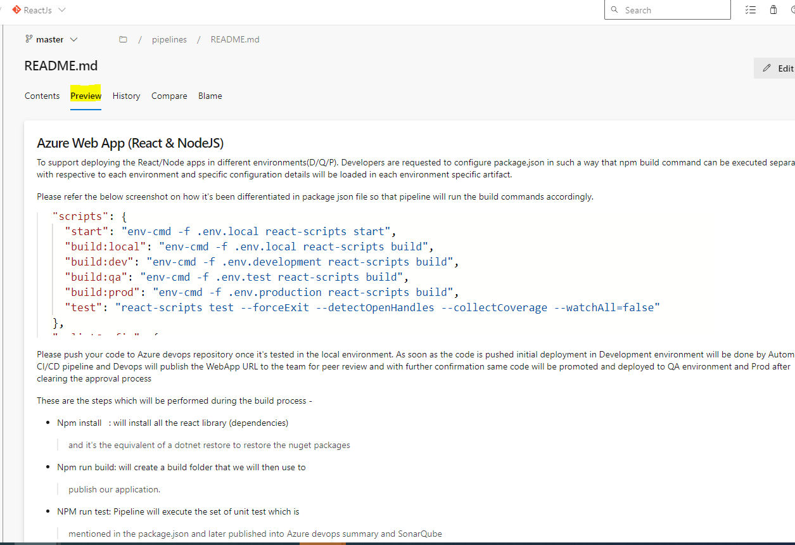
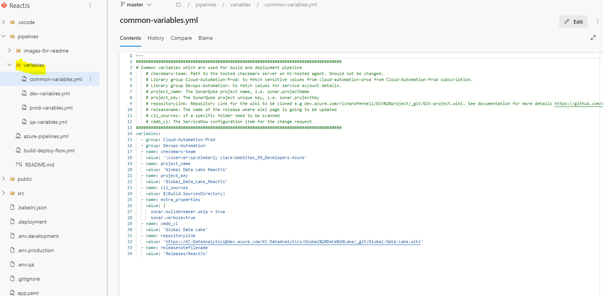
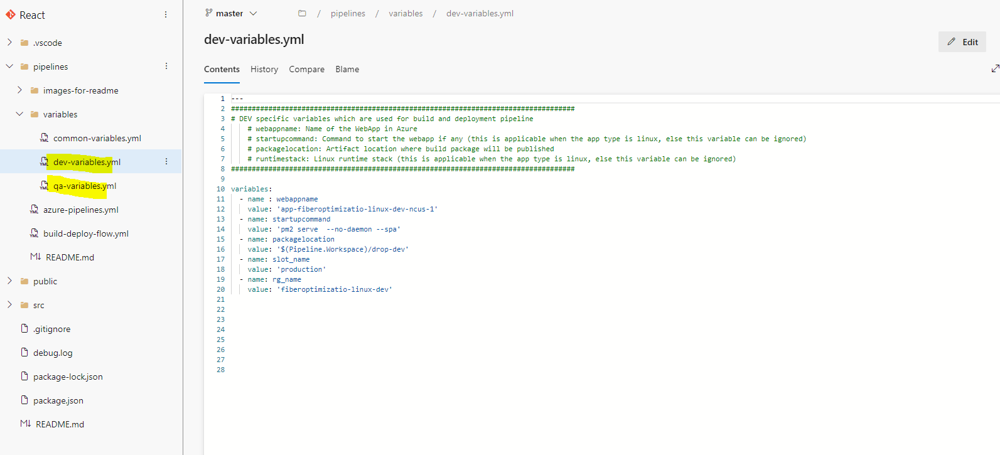
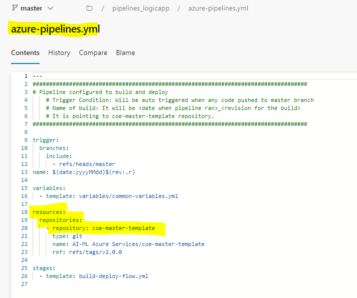
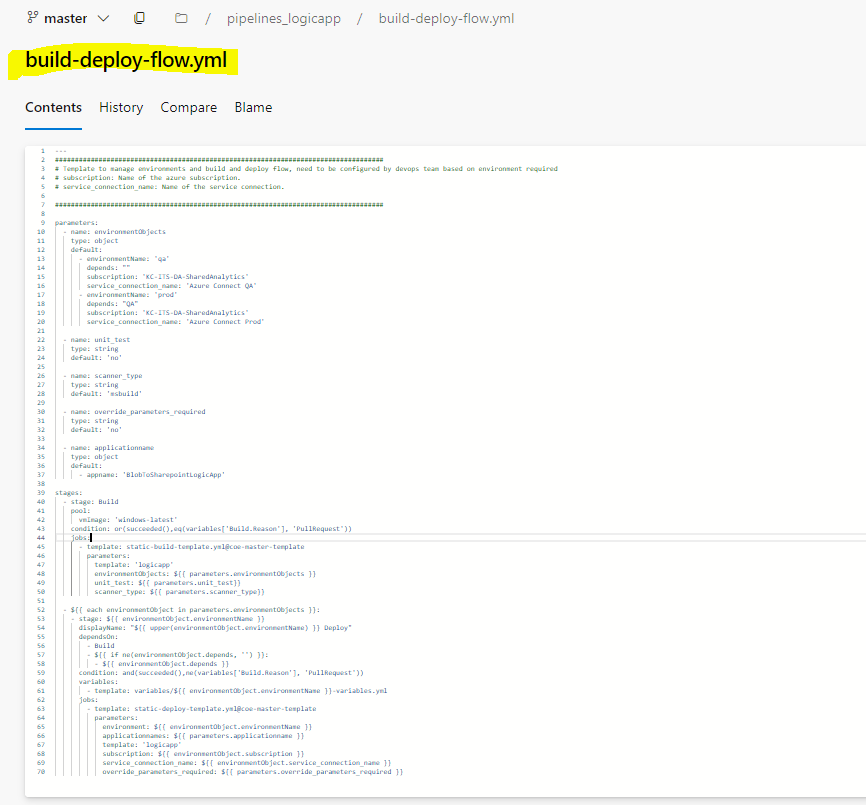
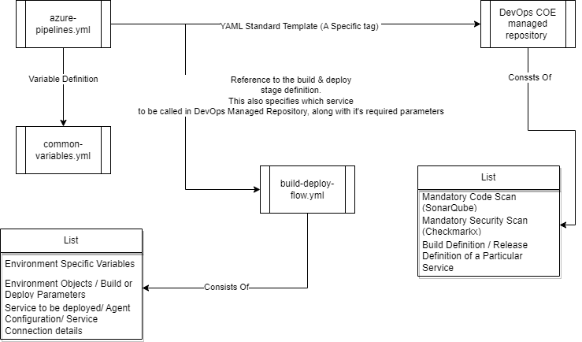

[[_TOC_]]

# Azure Web App (React & NodeJS)

To support deploying the React/Node apps in different
environments(D/Q/P). Developers are requested to configure package.json
in such a way that npm build command can be executed separately with
respective to each environment and specific configuration details will
be loaded in each environment specific artifact. 

Please refer the below screenshot on how it's been differentiated in
package json file so that pipeline will run the build commands
accordingly. 

> 

Please push your code to Azure devops repository once it's tested in the
local environment. As soon as the code is pushed initial deployment in
Development environment will be done by Automated CI/CD pipeline and
Devops will publish the WebApp URL to the team for peer review and with
further confirmation same code will be promoted and deployed to QA
environment and Prod after clearing the approval process 

These are the steps which will be performed during the build process - 

-   Npm install   : will install all the react library (dependencies)
    > and it's the equivalent of a dotnet restore to restore the nuget
    > packages 

-   Npm run build: will create a build folder that we will then use to
    > publish our application. 

-   NPM run test: Pipeline will execute the set of unit test which is
    > mentioned in the package.json and later published into Azure
    > devops summary and SonarQube 

-   Finally, it creates a drop artifact with the build files and later
    > will be used for deployments 

## Unit Testing

For React JS/NodeJS code, create a separate test folder in project repo
and add all the required unit test JS files and utilize any supported
code coverage tools like Jest, Mocha and add the dependencies,
exclusions in package.json file. During our build pipeline, Unit test
reports will be published to azure devops and code coverage report
generated by tools like jest/mocha will be further uploaded to Sonarqube
and user can see the detailed analysis on SonarQube code coverage. 

 

Please refer to the link below to understand why unit testing is
required on React/Node JS code and how you can start with it. 

[[https://www.smashingmagazine.com/2020/06/practical-guide-testing-react-applications-jest/]{.underline}](https://www.smashingmagazine.com/2020/06/practical-guide-testing-react-applications-jest/) 

## Azure Web App Release

In deploy stage We are deploying the build artifacts to
respective environments starting from Dev /QA and production with
approval process.

Release pipeline will consume the environment specific drop packages
which got generated during the build process and it deploys on the app
services. Steps which happen during the release pipeline --

-   Stop the web app service

-   Deploy/Update the app service with build packages with some startup
    > command if required to be passed 

-   Start the web app service  

To have a zero downtime on mission critical apps, DevOps support the
deployment slots on production deployments. Release pipeline will
deploy/update the app in dedicated slot and once its verified, Slots
will be swapped by the release pipeline, and it eliminates the downtime
and gives continuous user experience. 

Web deployment slots will be added into Production only. 

-   Add Manual Intervention 

-   Swap the web app service 

Create a deployment slot in Azure ADF portal as Stage, select clone
setting from prod resource then save. 

In start and stop web service tasks check "**Specify Slot or App Service
Environment"** checkbox**,** select Slot to **Stage**.**    ** 

In Deploy/update app service check **"Deploy to Slot or App Service
Environment"** checkbox**,** select Slot to **Stage**. 

In manual intervention add approvers so that they test application in
stage before swapping with production,**  ** 

In Deploy/update app service check **"Deploy to Slot or App Service
Environment"** checkbox**,** select Slot to **Stage**. 

In Swap web app service select **Swap Slots** as Action, check "**Swap
with Production"** checkbox and select Slot to **Stage**. 

# Web Application Build & Release Process

 

## Explanation:

-   While the development team works on a feature, it is expected that
    they follow GIT based Branching Strategy (You may refer the Git Flow
    Diagram below, also this
    [link](https://danielkummer.github.io/git-flow-cheatsheet/) for the
    commands). Once the code is checked into the feature branch, and
    build tested locally, the developer shall create a Pull Request to
    Master Branch (Please note Master Branch is the standard GOLD branch
    in KC, if you are using other branch, please get in touch with
    [**DL015142@kcc.com**](mailto:DL015142@kcc.com)). When the PR is
    created, it automatically triggers the build phase (only) in the
    YAML pipeline. Once the build validated/passed and the PR is
    Approved and Completed, the Code then merges to the master.

-   Once the Code is merged to Master, because of the branch being
    enabled with Continuous Integration, it triggers the YAML multistage
    Pipeline again automatically. This time the pipeline Builds the
    Code, Generates the Artifact, Deploys the Package to its "Path to
    Production". As a security practice, each stage is dependent of it's
    previous one for completion. That means, the pipeline will break and
    exit, if any phase/stage fails staring from build to deployment.
    Additionally we have approvals setup for PRODUCTION, for which that
    waiting time for approval is 1(one) day. If not approved within that
    time, it skips the PRODUCTION Deployment.

## Git Flow Diagram

 

# The YAML Multistage Pipeline

-   Each Repository should have a folder named 'Pipelines'. This folder
    consists of the DevOps "Pipeline as a Code" for each service.

 

-   The pipelines folder, as shown above consist of 2(two) more folders,
    and 3(three) files. Let's understand how they work. The first folder
    name 'images-for-readme' holds the '.png' images for the 'README.md'
    file. So ideally the development team is expected to read/preview
    for the 'README.md' file to understand how the YAML Multistage
    Pipeline works, as well as pre-requisites of action needed to build
    and deploy the service. When clicked on the preview mode of the
    'README.md' file it looks like this below (this is just an example
    shown below, please browse preview in your respective README file to
    refer your service)

 

-   The variables folder consists of mainly, common-variables, and
    environment specific variables for the release definition
    (dev-variables, qa-variables, prod-variables etc). The common
    variables are specific to each project, for configuring SonarQube,
    CheckMarkx, Library Groups, or any other build specific
    configurations. For each service, to run a build, these values must
    be populated.

 

-   The environment specific variables consist of release definition for
    each stage. For an example, name of the resource group, where the
    application is deployed in Azure, etc. For each service, these
    values might differ. For each service, before getting deployed these
    values must be populated.

 

-   The YAML file named 'azure-pipelines.yml' is the master YAML file,
    that defines the pipeline as a code. This file is again managed by
    DevOps COE, and has a reference to the DevOps COE managed central
    repository for managing all standard pipeline templates across KC.
    This file should not be deleted/modified by the project team, also
    this pipeline works only with the master branch, as 'master' branch
    being the GOLD Branch across KC. The tag specifies, which version of
    the DevOps Standard Code is being currently running. This tag shall
    change, if the DevOps Team releases an update/hotfix based on future
    enhancements.

 

-   Another YAML file you shall find, inside the pipeline folder named
    'build-deploy-flow.yml' This file is again managed by DevOps COE.
    The developer should not delete/modify the contents. This file has
    multiple configurations/parameters specific to a service. This
    template refers to the a specific service in the DevOps COE managed
    central repository, which enables it to use the standard
    build/deploy/pull request processes for a given service.

 

# The New YAML (Multistage Approach)

 

